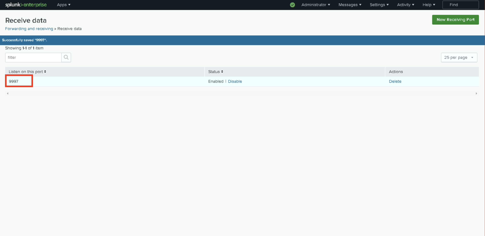
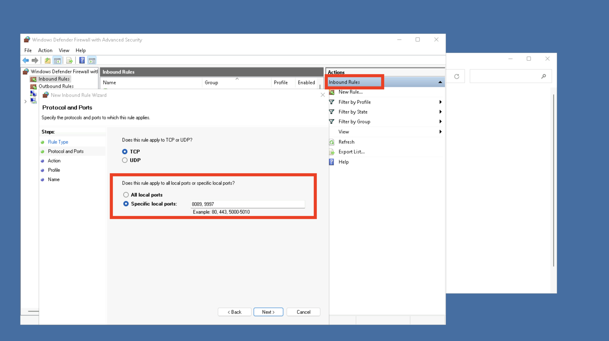
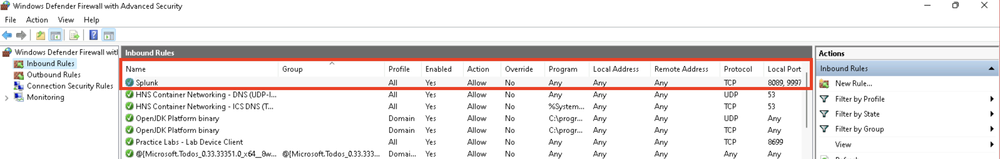
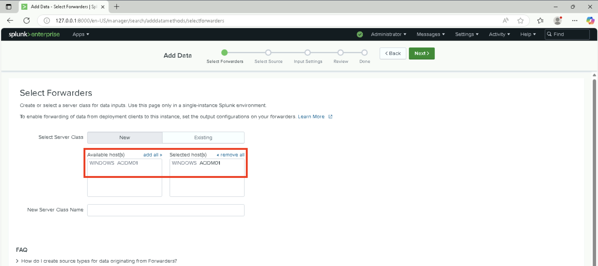
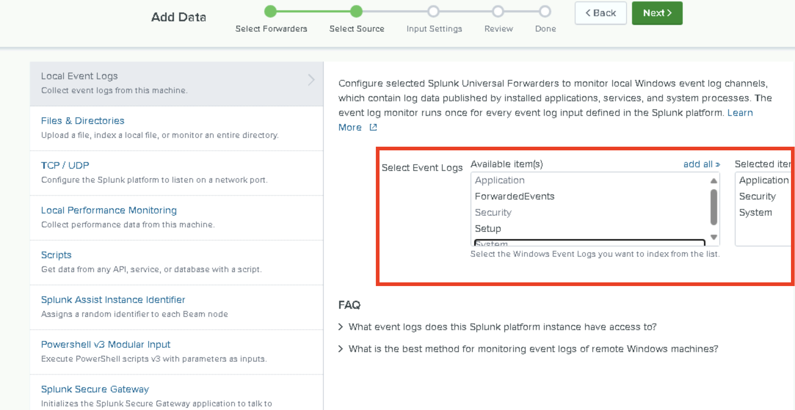
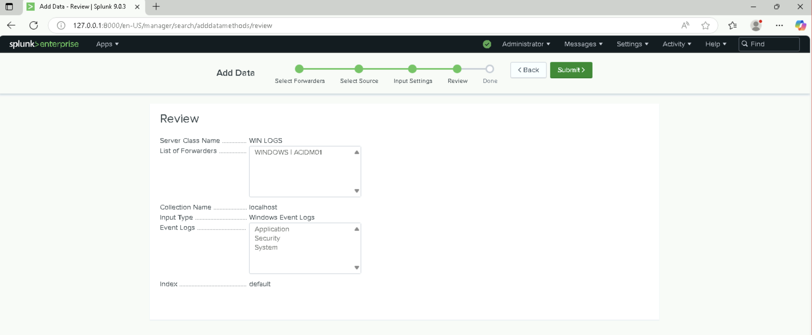
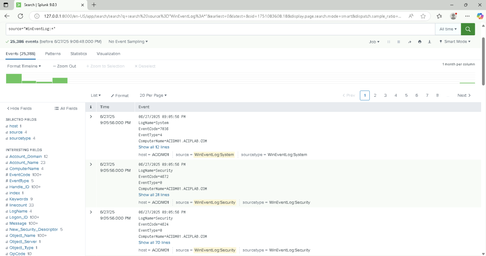

# 🔍 Splunk Enterprise Log Collection Lab

This lab demonstrates a brief setup and configuration of **Splunk Enterprise** to collect and analyze Windows event logs in a simulated domain environment. The goal was to create a centralized log monitoring solution for multiple domain devices using a Universal Forwarder and Splunk's web interface.

## 🧠 Lab Objectives

- Install and configure **Splunk Enterprise**
- Enable TCP data input on port `9997`
- Configure **Windows Firewall** to allow Splunk traffic
- Install and configure **Splunk Universal Forwarder** on a domain member server
- Forward logs from ACIDM01 to ACIWIN11
- Collect and search Windows **Application**, **Security**, and **System** event logs

---

## 🖥️ Environment Setup

| Device Name | OS                  | Role                      |
|-------------|---------------------|---------------------------|
| ACIWIN11    | Windows 11          | Domain Member Workstation - Used by end-users to log in with domain credentials and access network resources.           |
| ACIDM01     | Windows Server 2022 | Domain Member Server - A server joined to the domain that does not control the domain. Hosts services like file sharing, print services, web servers, applications, etc.   |
| ACIDC01     | Windows Server 2022 | Domain Controller - A server that manages and enforces security policies and authentication in a domain. Stores the Active Directory (AD) database (user accounts, groups, computers).        |

---

## 📦 Tools Used

- **Splunk Enterprise 9.0.3**
- Windows Defender Firewall
- Microsoft Edge

---

## 🛠️ Key Configurations

### 🔹 Splunk Enterprise Configuration (ACIWIN11)

- Enabled TCP data input on port `9997`
- Firewall rule created to allow inbound traffic on ports `8089`, `9997`
- Created a new Server Class for ACIDM01
- Selected and indexed Application, Security, and System logs

Open receiving port 9997 in Splunk  

Configure Windows Firewall inbound rule on workstation  

Verify new inbound rule exists  

---

### 🔹 Splunk Forwarder Setup (ACIDM01)

- Installed Splunk Universal Forwarder with domain credentials
- Forwarded logs to Windows 11 workstation acting as the Splunk Enterprise server on ports `8089` and `9997`
- Selected Windows Event Log sources

Select the Windows host forwarder 

Choose Event Log source  
  

Review Splunk data input config  
  

View log events in Splunk Search  
  

---

## 📊 Results

Successfully collected and visualized over 25,000 Windows Event Logs from the domain member server ACIDM01 using Splunk Web. Events from all three key categories—Application, Security, and System—were searchable and well-organized within the Splunk interface.

Log forwarding was configured using the Splunk Universal Forwarder installed on ACIDM01 (Windows Server 2022). This forwarder transmitted logs to the central Splunk Enterprise server running on ACIWIN11 (Windows 11 Domain Member Workstation).

The Splunk instance on ACIWIN11 was set up to receive data on port 9997, with appropriate firewall rules opened for both ports 9997 and 8089 to ensure reliable communication and log ingestion.

---

